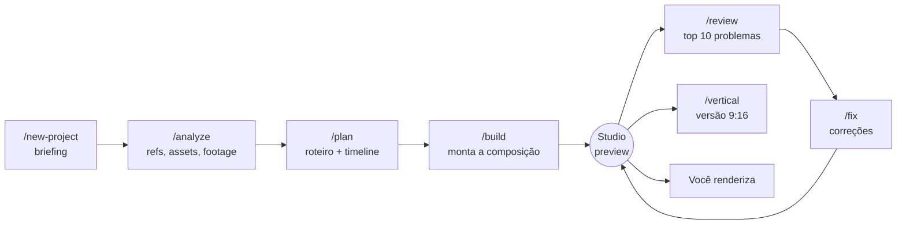

# 🎬 Remotion Video Editor: edição de vídeo automatizada com Claude Code

Um estúdio de edição dirigido por comandos. Você grava e escolhe as referências. O [Claude Code](https://claude.com/claude-code) analisa o material, escreve o roteiro de edição e monta o vídeo em código com [Remotion](https://www.remotion.dev). Você revisa no navegador, ajusta o que quiser e renderiza.

- **Vários vídeos no mesmo repo**, cada um com o próprio briefing, material e timeline.
- **Edição como dados**: cortes, zooms, legendas, memes, SFX e música ficam numa timeline tipada, editável pelo Claude ou pelo painel do Remotion Studio.
- **Você no controle do render**: o Claude monta e valida a composição, mas nunca renderiza.
- **Componentes que melhoram a cada vídeo**: cada vídeo novo reaproveita e expande a mesma biblioteca.

---

## Como funciona



Cada etapa salva o resultado em arquivo (`project.md` → `ANALYSIS.md` → `EDIT_PLAN.md` + timeline → `REVIEW.md`). Dá para parar e voltar quando quiser, inclusive em outra sessão.

---

## Setup

Requisitos: [Node.js](https://nodejs.org) 18+ e [Claude Code](https://claude.com/claude-code) (CLI, desktop ou extensão de IDE). O ffmpeg já vem embutido no Remotion.

```bash
npm i
```

```bash
npm run dev
```

O segundo comando abre o Remotion Studio em `http://localhost:3000`.

---

## Começando um vídeo

**1. Crie o vídeo.** No Claude Code:

```
/new-project minecraft-hardcore-01
```

O Claude faz as perguntas do briefing (tipo, tema, duração, estilo, formato...), cria as pastas, registra a composição e deixa o vídeo **ativo**.

**2. Coloque o material na pasta dele:**

```
public/
├── shared/
│   └── editing-pack/          ← pack usado em TODOS os vídeos (memes, SFX, músicas genéricas)
└── videos/
    └── minecraft-hardcore-01/
        ├── references/        ← vídeos que inspiram o estilo
        ├── assets/            ← memes, imagens e sons específicos deste vídeo
        └── footage/           ← suas gravações
```

**3. Rode o pipeline:**

```
/analyze      → estuda referências, cataloga assets e mapeia os melhores momentos da footage
/plan         → roteiro, storyboard e timeline
/build        → monta tudo e te dá o link do Studio
/review       → crítica de editor: os 10 maiores problemas
/fix 1,3,5    → aplica só as correções que você escolher (ou /fix para todas)
/vertical     → versão 9:16 recomposta (opcional)
```

**4. Renderize** pelo Studio (botão *Render*) ou pelo terminal:

```bash
npx remotion render minecraft-hardcore-01-main
```

---

## Comandos

| Comando | O que faz | Gera |
|---|---|---|
| `/new-project <slug>` | Briefing + pastas + registro; vira o vídeo ativo | `videos/<slug>/project.md` |
| `/switch [slug]` | Sem argumento: lista os vídeos e a etapa de cada um. Com slug: troca o ativo | `.active-video` |
| `/analyze` | Analisa referências, assets e footage (extrai frames para "assistir") | `ANALYSIS.md`, `INDEX.md` dos assets |
| `/plan` | Conceito, narrativa e storyboard, já traduzidos para a timeline | `EDIT_PLAN.md` + timeline |
| `/build [cena]` | Implementa a composição, valida e abre o Studio. Não renderiza | componentes + link do preview |
| `/review [intervalo]` | Revisa como editor profissional, sem alterar código | `REVIEW.md` |
| `/fix [itens]` | Aplica correções do REVIEW (todas ou `1,3,5`) | código/timeline + checklist atualizado |
| `/vertical` | Cria a versão 1080x1920 sobre a mesma timeline | `<slug>-vertical` |

Todos os comandos aceitam um slug como primeiro argumento para agir em outro vídeo sem trocar o ativo (ex.: `/review minecraft-hardcore-01`).

---

## Trabalhando com vários vídeos

O vídeo atual fica salvo em `.active-video`. Todo comando começa mostrando qual é:

```
🎬 Vídeo ativo: minecraft-hardcore-01 (etapa: build feito)
```

Para trocar, use `/switch <slug>` ou peça em linguagem natural: *"volta pro sea of thieves"*, *"bora fazer um vídeo novo de valorant"*. No Studio, cada vídeo aparece em uma pasta própria.

---

## Ajuste fino no Studio

A timeline de cada vídeo (o `defaultProps` da composição dele em `src/Root.tsx`) está ligada ao painel de props do Studio. Dá para mudar o início e a duração dos clipes, o texto das legendas, o zoom, a posição dos memes e o volume, ver o resultado na hora e salvar de volta no código. Os tempos ficam em segundos e os caminhos são relativos a `public/`.

---

## Estrutura do repo

```
.claude/
├── skills/               comandos (/build, /plan...) + skills do Remotion e de direção
├── settings.json         permissões (render bloqueado para o Claude)
└── launch.json           config do Studio para o preview
videos/<slug>/            project.md, ANALYSIS.md, EDIT_PLAN.md, REVIEW.md
styles/<tipo>.md          regras por tipo de vídeo (ex.: gameplay.md)
STYLE_GUIDE.md            princípios de edição acumulados entre vídeos
src/
├── components/           GameplayClip, Caption, ImpactText, ImageOverlay...
├── compositions/         TimelineVideo: renderiza qualquer timeline
├── utils/                timelineSchema (zod), helpers
├── videos/<slug>/scenes/ cenas específicas de um vídeo
└── Root.tsx              um Folder por vídeo, com a timeline de cada um
```

## Perfis de estilo

Cada vídeo tem um **tipo** (gameplay, explainer, vlog...). As regras do tipo ficam em `styles/<tipo>.md`. Quando você cria um vídeo de um tipo novo, o `/new-project` cria o perfil. O `STYLE_GUIDE.md` junta o que o `/analyze` aprende e que vale para qualquer vídeo, então a edição fica mais consistente com o tempo.

---

Feito com [Remotion](https://www.remotion.dev/docs) + [Claude Code](https://claude.com/claude-code). Algumas empresas precisam de uma [licença da Remotion](https://github.com/remotion-dev/remotion/blob/main/LICENSE.md).
